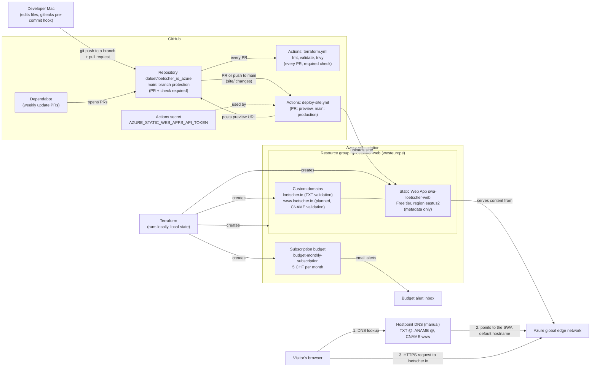

# Architecture

This page describes the architecture of loetscher.io. Today these parts exist: the website files in `site/` (Step 1), the subscription budget (Step 2), the resource group, Static Web App, and apex custom domain (Step 3), all created by Terraform from `infra/`, and the GitHub repository `daloet/loetscher_io_azure` with its workflows, Dependabot, and branch protection (Step 4). The site is deployed and reachable on its default hostname. The final DNS checks and the `www` redirect (Step 5) are planned. See the status table in the [README](../README.md#status).

## Diagram

## Components

| Component | What it is | Status |
|-----------|-----------|--------|
| Website (`site/`) | Plain HTML and CSS files. No build step, no JavaScript. | Deployed (Step 4); served on `<swa-default-hostname>` until DNS is done |
| Subscription budget | `budget-monthly-subscription` (in `infra/budget.tf`): a monthly cost threshold of 5 CHF (the billing currency) on the whole subscription, starting 2026-09-01. It sends emails at 20% of actual cost (1 CHF), 100% of actual cost, and 100% of forecast cost. It only warns; it does **not** stop or cap spending. See [ADR 0005](decisions/0005-subscription-level-budget.md). | Live (Step 2) |
| Resource group `rg-loetscher-web` | A folder in Azure that holds the project's resources. Region `westeurope` (variable `location`). | Live (Step 3) |
| Static Web App `swa-loetscher-web` | Azure's service for hosting static files, on the **Free** plan. It serves the site over HTTPS and provides free TLS certificates for custom domains. Its region is `eastus2` (variable `static_web_app_location`), because `westeurope` did not accept new Static Web Apps ([ADR 0008](decisions/0008-swa-region-eastus2.md)). The region only holds metadata; content is served from Azure's global **edge** network (servers close to visitors worldwide). Preview environments and `staticwebapp.config.json` changes are enabled. It has an auto-generated **default hostname** of the form `<random-name>.azurestaticapps.net` (called `<swa-default-hostname>` in these docs). | Live (Step 3) |
| Free tier limits | 100 GB bandwidth per month, 2 custom domains, 3 preview environments. The Free plan has no **overage billing** (charges for use above the quota), so it cannot incur costs. The budget is the backstop. | Applies since Step 3 |
| Terraform | A tool that creates cloud resources from code files in `infra/`. It runs on the developer's Mac and signs in through the Azure CLI login. The subscription ID comes from the `ARM_SUBSCRIPTION_ID` environment variable, not from a file ([ADR 0007](decisions/0007-subscription-id-via-env-var.md)). Its **state file** (a record of what it created) stays on the local machine and is never committed ([ADR 0006](decisions/0006-local-terraform-state.md)). The provider registers only the `Microsoft.Web` **resource provider** (the Azure service namespace that Static Web Apps belong to). | In use since Step 2 |
| Custom domain `loetscher.io` | The apex (bare) domain and the **canonical host** ([ADR 0010](decisions/0010-apex-as-canonical-host.md)). Validated with a `TXT` record (`dns-txt-token`). Terraform does not wait for validation; Azure checks DNS in the background. | Created (Step 3); valid once the DNS records exist |
| Custom domain `www.loetscher.io` | Validated with `cname-delegation`, which Azure checks immediately. Therefore it is only created when `enable_www_domain = true`, after the `CNAME` exists ([ADR 0009](decisions/0009-two-step-custom-domain-rollout.md)). Will redirect to `loetscher.io` via the portal's "default domain" setting. | Planned (after the DNS records; redirect in Step 5) |
| Hostpoint DNS | The DNS provider for `loetscher.io`. **DNS** translates a name like `loetscher.io` into the address of a server. Records (`TXT @`, `ANAME @`, `CNAME www`) are edited by hand in the Hostpoint control panel ([ADR 0003](decisions/0003-dns-at-hostpoint-manual-records.md)). See [DNS records at Hostpoint](runbook.md#dns-records-at-hostpoint). | Manual; checks in Step 5 |
| Deployment token | A secret from the Static Web App that lets the workflow upload files. Terraform exposes it as the sensitive output `deployment_token`. It was piped (never printed) into the GitHub **Actions secret** `AZURE_STATIC_WEB_APPS_API_TOKEN` (an encrypted value that workflows can use but nobody can read back). | Live (GitHub secret since Step 4) |
| GitHub repository | `daloet/loetscher_io_azure`, public. Stores the code, workflows, and docs. Accessed over HTTPS with the `gh` credential helper. Secret scanning, push protection, Dependabot alerts, and Dependabot security updates are on. | Live (Step 4) |
| Branch protection on `main` | Nobody pushes to `main` directly: every change is a **pull request** (PR) that needs the passing check `fmt, validate, trivy` and must be up to date with `main`. Also: enforced for admins, linear history, conversation resolution, no force pushes or deletion. See [security](security.md#branch-protection-on-main). | Live (Step 4) |
| GitHub Actions: `deploy-site.yml` ("Deploy site") | GitHub's automation service runs this workflow when `site/` or the workflow changes. **Push to `main`** (or a manual run): deploys to production. **PR from this repository**: deploys a **preview environment** (a temporary copy of the site at its own public URL) and posts the URL as a PR comment; the preview is deleted when the PR closes. PRs from forks and from Dependabot are skipped, because GitHub gives them no secrets. Superseded preview runs are cancelled; production runs always finish. Free tier: at most 3 previews at a time. | Live (Step 4) |
| GitHub Actions: `terraform.yml` ("Terraform checks") | Runs on every PR (it is the required check), on pushes to `main` that touch `infra/`, and by hand: `terraform fmt -check`, `init -backend=false -lockfile=readonly`, `validate`, and a Trivy scan from a checksum-verified binary. No `plan` and no Azure login ([ADR 0011](decisions/0011-ci-checks-without-plan-or-oidc.md), [ADR 0012](decisions/0012-trivy-pinned-binary.md)). | Live (Step 4) |
| Dependabot | A GitHub bot that opens update PRs weekly for the pinned GitHub Actions and the `azurerm` provider (`.github/dependabot.yml`). It ignores `Azure/static-web-apps-deploy` and major `azurerm` versions; those are updated by hand ([runbook](runbook.md#handle-dependabot-pull-requests)). | Live (Step 4) |

## Terraform outputs

| Output | What it shows |
|--------|---------------|
| `default_host_name` | The Static Web App's generated hostname, `<swa-default-hostname>`. |
| `dns_records` | The three records to create at Hostpoint: `TXT @` with `<txt-validation-token>`, `ANAME @` to `<swa-default-hostname>`, `CNAME www` to `<swa-default-hostname>`. |
| `deployment_token` | Sensitive. Never print it. Only ever piped straight into the GitHub secret (see [Rotate the deployment token](runbook.md#rotate-the-deployment-token)). |
| `budget_id` | The budget's resource ID (contains the subscription ID; don't share it). |

## How the pieces connect

1. **Build the infrastructure (once).** Terraform runs on the developer's Mac. It created the budget first, on its own (Step 2). In Step 3 it created the resource group, the Static Web App, and the apex custom domain.
2. **Connect DNS.** The user creates the records from `terraform output dns_records` at Hostpoint. Azure then validates `loetscher.io`. After that, `enable_www_domain = true` adds `www.loetscher.io` ([ADR 0009](decisions/0009-two-step-custom-domain-rollout.md)).
3. **Connect GitHub (Step 4).** The Static Web App's deployment token was piped straight from Terraform into the GitHub secret, without being printed.
4. **Change and deploy (every change).** The developer commits on a branch (the gitleaks hook checks each commit), pushes it, and opens a pull request. The Terraform checks run; if `site/` changed, the deploy workflow publishes a preview and posts its URL on the PR. After merging, the push to `main` deploys `site/` to production. See [Update the site](runbook.md#update-the-site). Dependabot opens PRs for updates the same way.
5. **Serve visitors.** A visitor's browser asks Hostpoint DNS where `loetscher.io` lives. The `ANAME` record points to the Static Web App's default hostname. The browser loads the site over HTTPS from Azure's edge. The security headers from `site/staticwebapp.config.json` are added to every response. Requests to `www.loetscher.io` will redirect to `loetscher.io` (planned, Step 5).
6. **Watch costs.** The Free plan cannot incur charges. If Azure costs ever appear anyway, the budget sends an email alert. See [Check the budget](runbook.md#check-the-budget).

## Related decisions

- [0001: Plain HTML, no build step](decisions/0001-plain-html-no-build.md)
- [0002: Azure Static Web Apps Free tier](decisions/0002-azure-static-web-apps-free-tier.md)
- [0003: DNS at Hostpoint with manual records](decisions/0003-dns-at-hostpoint-manual-records.md)
- [0004: Strict CSP, no inline code](decisions/0004-strict-csp-no-inline-code.md)
- [0005: Subscription-level budget](decisions/0005-subscription-level-budget.md)
- [0006: Local Terraform state](decisions/0006-local-terraform-state.md)
- [0007: Subscription ID via environment variable](decisions/0007-subscription-id-via-env-var.md)
- [0008: Static Web App region eastus2](decisions/0008-swa-region-eastus2.md)
- [0009: Two-step custom domain rollout](decisions/0009-two-step-custom-domain-rollout.md)
- [0010: Apex loetscher.io as the canonical host](decisions/0010-apex-as-canonical-host.md)
- [0011: CI checks without terraform plan or OIDC](decisions/0011-ci-checks-without-plan-or-oidc.md)
- [0012: Trivy in CI as a checksum-verified pinned binary](decisions/0012-trivy-pinned-binary.md)
